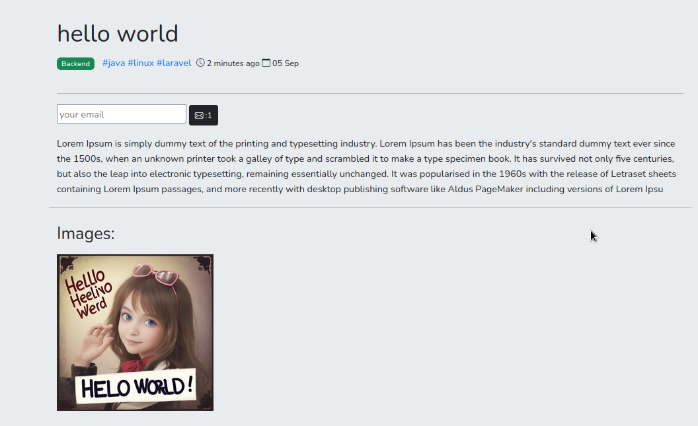
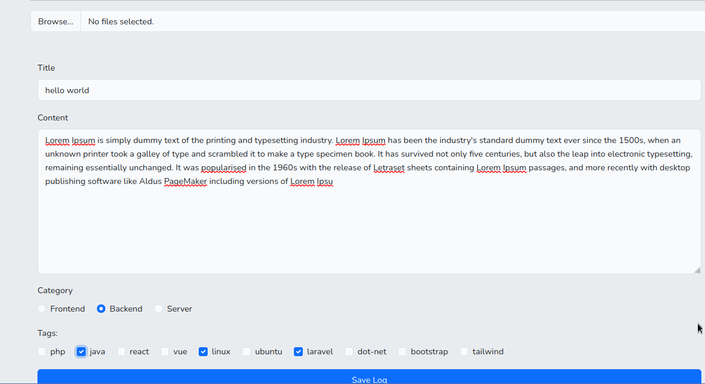
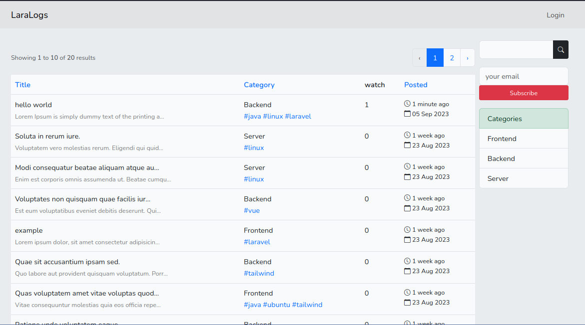
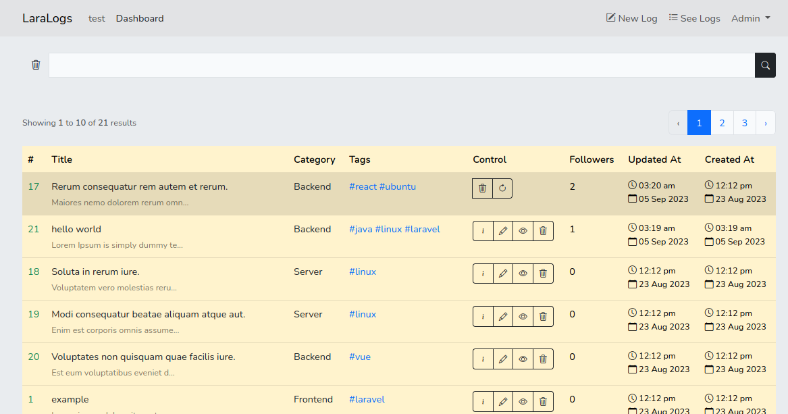

### About
A simple blog site using Laravel & Bootstrap (Server-side rendering)

#### ER Diagram

### Screenshots

#### implementations
- created **form requests** for input validation
- use one to one, one to many & many to many **Eloquent relationships**
- create **observers** for deleting image files on deleting related database record
- create **local scope** for querying database
- send email using **queues** and **Mailable** objects
- use **eager loading** to optimize database queries

#### features
- **CRUD** actions for categories, tags, and posts
- images can be added to a post with label
- **soft deleting** blog posts
- allow users to **subscribe to new posts by email**, unsubscribe by URL
- allow to follow a post and **receive emails** on every update to that post